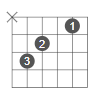
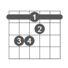

# Canon Pop Song

A list of chinese pop song with canon chord.

## Chore

capo = 2

| C | G | Am | Em | F | Em | F | G |
| - | - | -- | -- | - | -- | - | - |
|  |  |  |  |  |  |  |  |

## Pop Song

- 情非得已-庾澄庆

```text
只怕我自己 会爱上你 不敢让自己 靠的太近
怕我没什么 能够给你 爱你也需要 很大的勇气
只怕我自己 会爱上你 也许有天 会情不自禁
想念只让自己 苦了自己 爱上你 是我情非得已
```

- young for you-gala 

```text
Sunday's coming I wanna drive my car.
To your apartment with a present like a star.
Forecaster said the weather may be rainy hard.
But I know the sun will shine for us.
```

3. 青春修炼手册-tfboys 
4. 纸短情长-烟把儿乐队 
5. 学猫叫-小潘潘 
6. 当-动力火车 
7. 不再犹豫-beyond 
8. lemon tree-Fool's Garden 
9. 红日-李克勤 
10. 江南-林俊杰
11. 爱很简单-套着
12. 老鼠爱大米-杨臣刚
13. NewBoy-朴树
14. 千里之外
15. K歌之王
16. 痴心绝对-李圣杰
17. 梦醒时分-伍佰
18. 小手拉大手-梁静茹
19. 当你孤单你会想起谁-
20. 私奔到月球-陈绮贞
21. 胆小鬼
22. 真的爱你
23. 稻香
24. 浪子回头
25. 当你·王心凌
26. 大城小爱·王力宏
27. 给我一首歌的时间·周杰伦
28. 依然爱你·王力宏
29. 梦醒时分
30. 朋友·周华健
31. 我的歌声里
32. 樱花草

